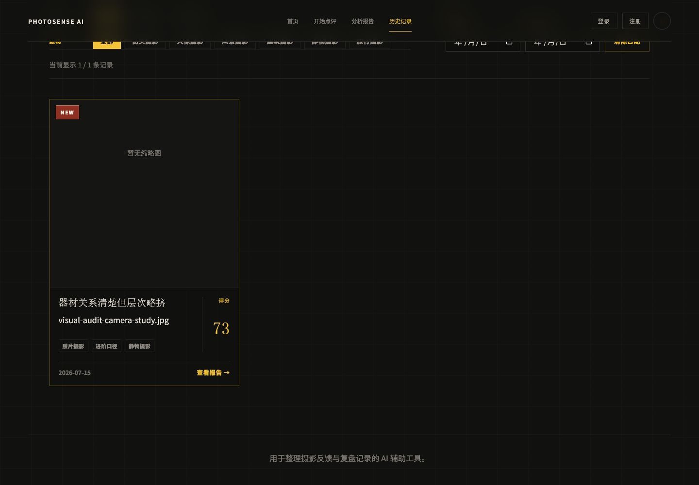
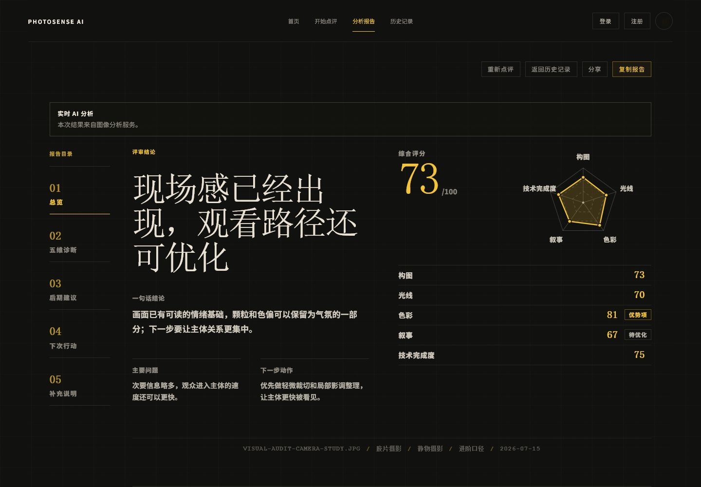
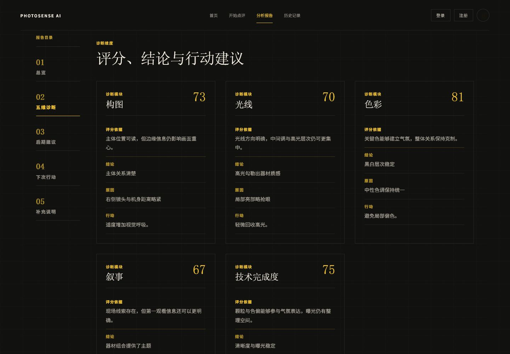
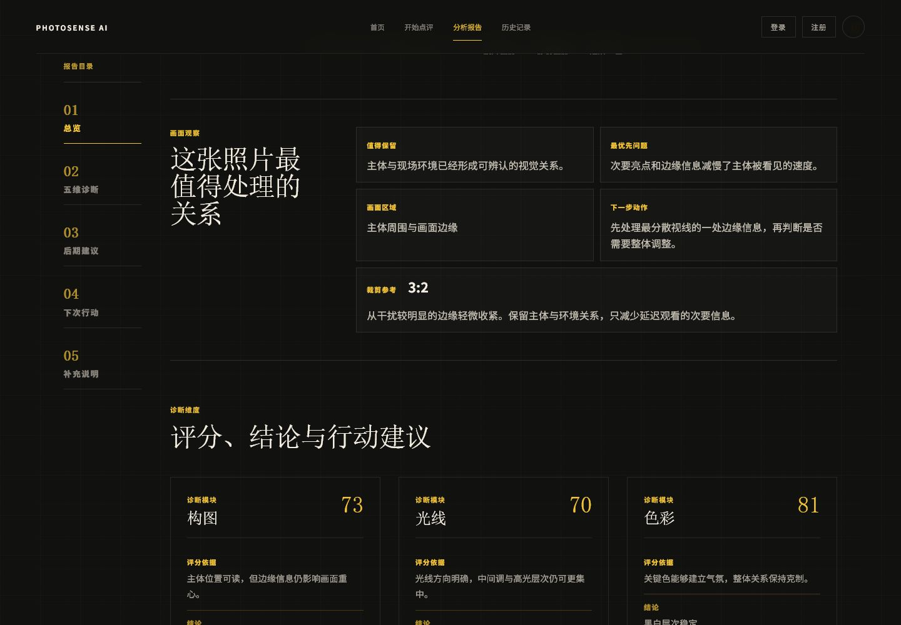
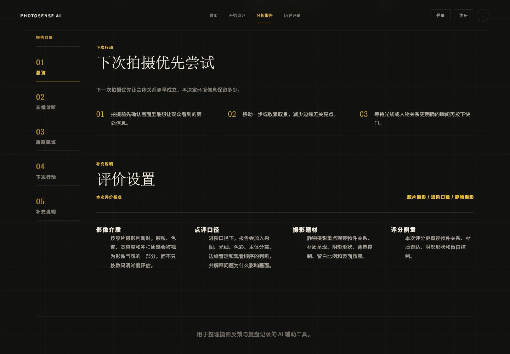

# PhotoSense AI 产品审查与下一步迭代指引

审查日期：2026-07-15  
审查版本：`PhotoSense-AI-core-experience-v3.1-2026-07-15`  
范围：首页、开始点评、分析报告、历史记录，以及核心前后端验证。登录/注册、分享功能按当前约定不列入本轮整改范围。

## 首轮用户测试校准

旧版 9 人用户测试已整理为 `USER_TEST_FINDINGS_AND_ITERATION_POLICY_2026-07-15.md`，并作为后续优先级的用户证据。测试验证了短流程与再次使用潜力，同时把“视觉阅读负担、建议不够具体、缺少对比证据、初学者学习价值不足”提升为本轮视觉与报告重构的核心目标。本文原有工程与体验审查继续有效；当两份文档存在优先级冲突时，先保持已经验证的主流程，再以用户测试指标验证视觉和内容调整。

## 结论

PhotoSense AI 已经具备适合作品集展示的产品骨架：视觉语言鲜明，上传—设置—分析—报告—历史复盘的闭环完整，报告内容也明显区别于通用聊天式 AI 输出。当前最需要做的不是继续增加功能，而是降低阅读与操作负担，并完成移动端、可访问性和工程可维护性的收尾。

| 维度 | 评价 | 说明 |
| --- | --- | --- |
| 视觉识别 | 8.2 / 10 | 黑金编辑部式视觉统一，摄影作品与网格系统形成明确品牌感。 |
| 核心流程 | 7.8 / 10 | 主流程完整，状态、错误、重试、历史记录和对比能力均已有实现。 |
| 报告可读性 | 7.6 / 10 | 本轮重排后层级更清楚；长报告仍存在连续阅读负担。 |
| 移动端与可访问性 | 6.6 / 10 | 760 px 验收无横向溢出，但键盘语义、对比度和触控尺寸还需要专项检查。 |
| 工程可维护性 | 6.0 / 10 | 自动化验证较完整，但单体 `App.tsx` 与约 9,760 行样式文件增加后续视觉回归成本。 |

## 本轮修改验收

1. **历史卡片：通过。** 长标题和长文件名被限制在评分分隔线左侧；实测标题右边界与评分区之间保留约 18 px 间距。

   

2. **报告首屏：通过。** 结论区与评分区重新分配宽度，评分、雷达图和维度概览共同填充右侧，不再出现大面积无效空白。

   

3. **五维诊断：通过。** 桌面端由五个狭窄长列改为三列卡片，信息密度和行长更适合扫描；第二行保留自然节奏。

   

4. **画面观察：通过。** 标题与内容改为编辑式双栏结构，观察项压缩为规则卡片，解决原先标题区过疏、正文分散的问题。

   

5. **补充说明：通过。** 章节移动到“下次行动”之后，目录增加“05 补充说明”，锚点可达且顺序与正文一致。

   

6. **窄屏：通过基础布局检查。** 在 760 × 900 视口下，报告首屏、评分区和五维诊断均折叠为单列，侧边目录变为普通流布局，页面无横向溢出。

## 主要优势

- 视觉体系有记忆点，不像常见的 AI 工具模板；原始摄影素材进一步增强真实性和作品集说服力。
- 点评前的“介质 / 口径 / 题材”会进入分析上下文，形成真正的产品逻辑，而不是装饰性筛选。
- 报告不只给分数，还提供依据、结论、原因与行动，符合摄影复盘场景。
- 历史记录提供搜索、筛选、排序、删除和双记录对比，已经具备持续使用价值。
- 对真实 AI、示例报告和来源未知记录有明确标记，产品诚实度较好。
- 当前自动化检查覆盖文件校验、状态切换、历史记录和报告导航等关键行为。

## 问题与优先级

### P1：下一轮优先处理

1. **页面切换仍保留旧的 URL hash。** 从报告的 `#report-context` 切到首页或点评页后，地址中的 hash 仍存在。虽然页面切换会调用滚动复位，但残留锚点可能造成浏览器返回、刷新或后续重渲染时的定位混乱。建议在非报告页面切换时清理 hash，并为此补一个交互测试。

2. **历史卡片的交互语义存在风险。** 当前整张 `article` 使用 `role="button"`，管理模式下内部又包含“选择对比”和“删除”按钮。视觉上可用，但嵌套交互对屏幕阅读器和键盘焦点不够理想。建议把“查看报告”改为真正的链接或按钮，卡片本身保持非交互容器。

3. **需要一次专项可访问性检查。** 重点检查灰色辅助文字与深色背景的对比度、黄色小字号标签、焦点可见性、44 px 触控目标，以及状态提示是否会被读屏软件及时播报。截图不能替代对比度计算和真实读屏测试。

4. **移动端主导航需要真实设备验收。** 760 px 下内容区无横向溢出，但顶部导航、登录入口和报告目录在 360–430 px 手机宽度下仍可能拥挤。建议增加 390 × 844 的端到端验收并记录截图。

### P2：体验与性能完善

5. **首页信息和背景照片竞争注意力。** 品牌感强，但局部文字压在高细节照片上，扫读成本偏高。建议统一文本底板透明度，减少同一视口内同时出现的装饰层数量。

6. **报告仍然偏长。** 当前层级已经改善，但五维诊断、后期建议、下次行动和补充说明连续展开时，用户很难快速回到核心结论。可考虑“摘要 / 完整报告”两级阅读，或允许折叠每个维度的“原因与行动”。

7. **日期格式不统一。** 不同页面存在 `2026年7月15日` 与 `2026-07-15` 两种格式。建议统一展示格式，内部仍保留 ISO 值。

8. **首页约 5 MB 图片会影响移动端首屏。** 版权没有问题，但仍有加载性能风险。建议输出 AVIF/WebP、多尺寸 `srcset`，只预加载首屏关键图，其余图片延迟加载。

9. **真实 AI 分析的等待感仍可优化。** 现有进度和错误状态是优点；下一步可增加“正在检查构图 / 光线 / 色彩”等阶段提示，并记录真实服务的 P50/P95 响应时间，避免只用视觉进度掩盖慢请求。

### P3：视觉冻结后再做

10. **样式文件过大且存在多轮覆盖。** `src/styles.css` 约 9,760 行，同一组件选择器在不同区段重复出现，后续改一处可能触发意外回归。建议等当前视觉方向确认后，再按首页、点评、报告、历史记录拆分样式；不要在视觉仍频繁变化时同时大规模重构。

11. **`App.tsx` 承担过多页面职责。** 可在不改变状态模型的前提下，逐步拆为页面组件与报告子区块。拆分成功标准应是现有测试全部通过、DOM 语义不变、视觉截图无回归。

## 建议的下一轮顺序

1. 导航 hash、历史卡片语义与键盘焦点整改。
2. 390 px 手机端：首页、点评、报告、历史记录四页逐页验收。
3. 辅助文字对比度、触控尺寸和读屏状态提示检查。
4. 图片格式与延迟加载优化，并比较优化前后的首屏体积和加载时间。
5. 增加“摘要 / 完整报告”阅读模式的小范围原型。
6. 视觉冻结后再拆分 CSS 和页面组件。

## 验证与限制

- `npm run check`：类型检查、21 个自动化测试和生产构建全部通过。
- 前端与后端本地服务可启动；后端健康接口单独复核。
- 浏览器验收使用当前代码和本地测试记录，完成桌面端与 760 px 基础响应式检查。
- 本轮未在浏览器中重新上传真实文件并消耗真实 AI 配额；真实图片分析逻辑由自动化测试和用户此前本地测试共同覆盖。
- 登录/注册与分享按本轮约定不纳入结论，不代表这些功能已经达到发布质量。
