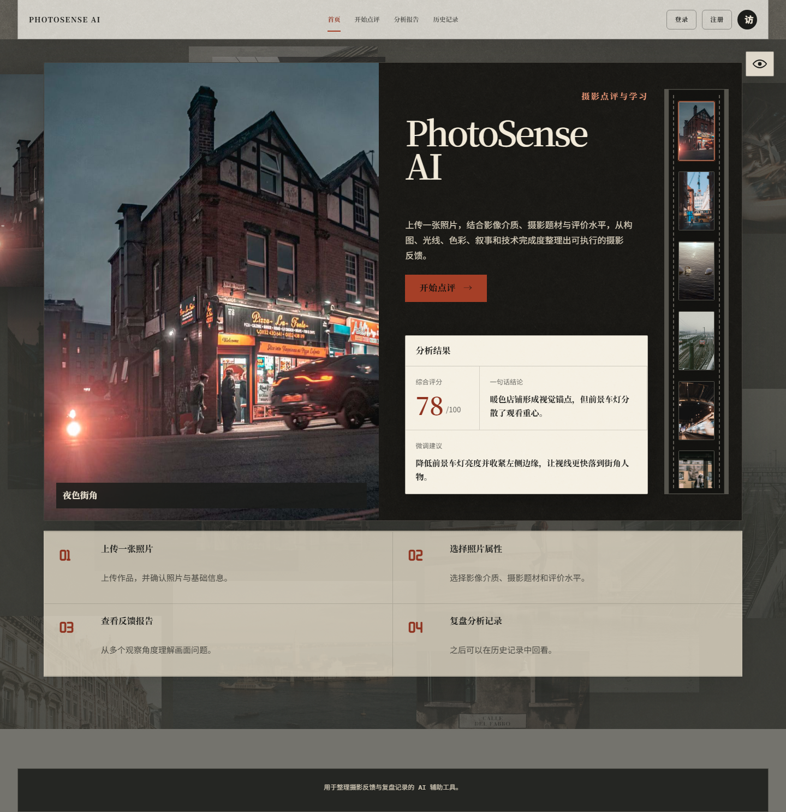
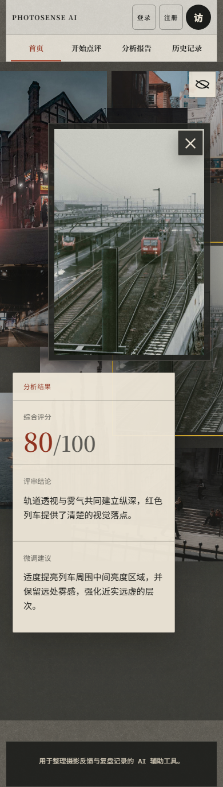
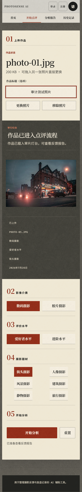
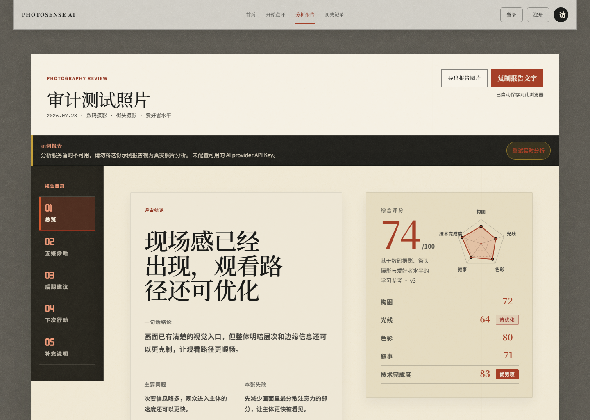
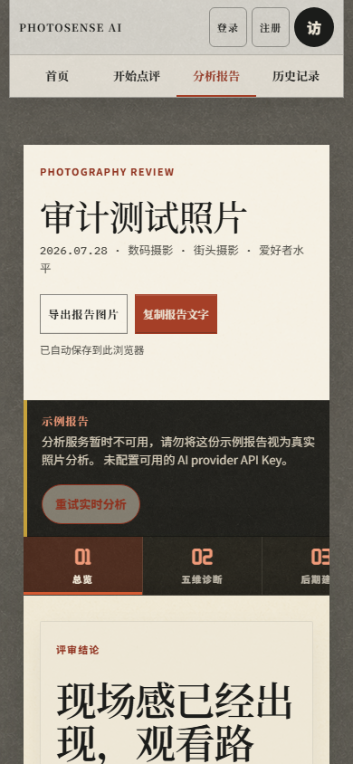
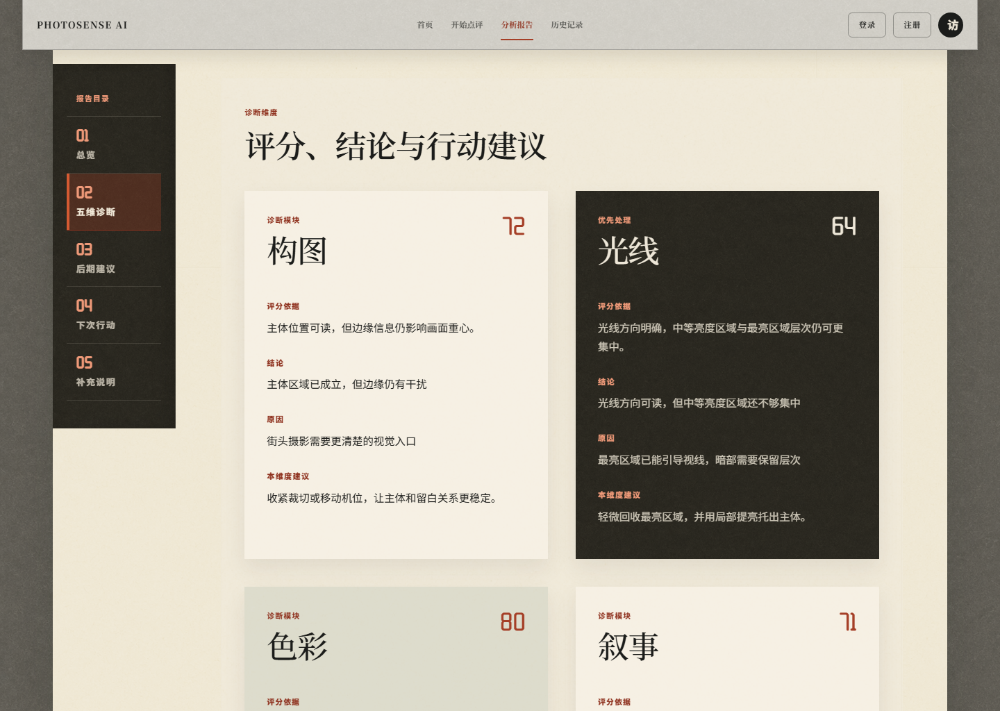
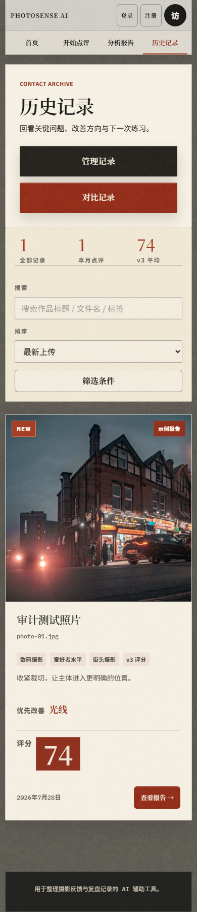
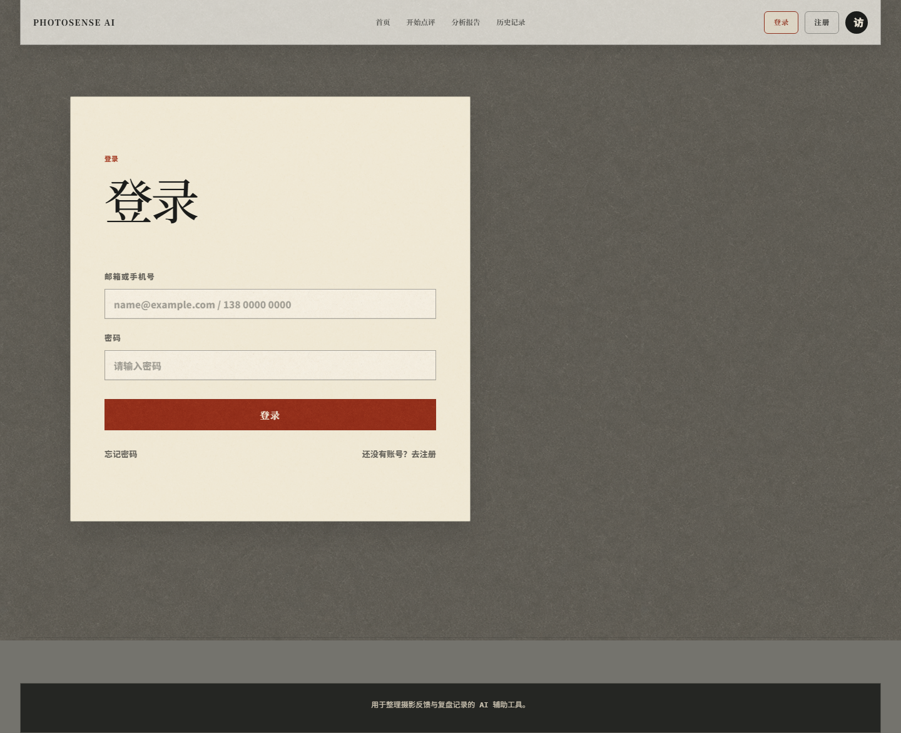

# PhotoSense AI 系统性产品审计

审计日期：2026-07-28  
审计版本：本地 `http://127.0.0.1:8799/` 对应 `deliverables/photosense-ai-github-current`  
审计性质：只读产品、UX、UI、可访问性、可信度与工程审查；未修改产品源码，未部署远端。

## 1. 总结判断

PhotoSense AI 的概念成立，而且已经明显超过“单页视觉原型”：它拥有上传、评价语境、分析状态、结构化报告、后期预览、历史记录、报告导出与旧版本兼容的完整闭环。其视觉识别、摄影语境和报告结构都具有作品集价值。

但它目前仍属于“完成度较高的作品集级产品原型”，还不是可以放心公开运营的正式产品。最大的缺口不是再加功能，而是：

1. 尚未用真实标定集证明评分和评语可信；
2. 分析图片被压缩到 768 px、JPEG 质量 0.55，技术判断证据不足；
3. 登录是未标注的演示功能，公开 API 也缺少限流和真实权限；
4. 首页首屏约传输 20.0 MB；
5. 移动端报告约 8,927 px 高，粘性目录会覆盖正文标题；
6. 用户意图和视觉证据尚未进入点评闭环。

综合判断：

- 作品集原型成熟度：8 / 10
- 面向目标用户的产品价值：7 / 10
- 正式公开产品准备度：5 / 10

## 2. 概念与目标用户

### 核心概念

用户上传一张照片，系统结合影像介质、摄影题材和评价水平，用构图、光线、色彩、叙事、技术完成度等维度，整理出解释与行动建议。

### 最匹配用户

- 希望建立“判断照片为什么成立”的摄影初学者；
- 有稳定拍摄兴趣、但缺少及时反馈的摄影爱好者；
- 需要轻量复盘，而不是竞赛级裁判结论的普通创作者。

### 不宜直接承诺的用户

- 需要比赛、商业交付或作品集录取级权威评分的专业摄影师；
- 需要精确判断锐度、噪点、焦点、镜头与参数问题的技术用户；
- 需要云端多设备同步、真实账户、团队协作和隐私合规的正式消费者。

### 最合适的定位

> 面向摄影学习者的 AI 复盘教练：先说明画面是否成立，再指出可见证据，最后给出一项能执行的拍摄或后期行动。

不建议把产品定位成“照片好坏的权威裁判”。当前更可信的价值是帮助用户形成判断方法，而不是提供绝对排名。

## 3. 当前优点

1. **核心闭环完整。** 上传、失败恢复、取消、报告、保存、筛选、删除和回看均已实现。
2. **视觉辨识度高。** 暗房、编辑手册、暖纸和真实照片构成稳定品牌语言，明显区别于普通 AI SaaS。
3. **照片是第一视觉资产。** 用户照片没有被滤镜和装饰覆盖。
4. **报告不是聊天输出。** 结论、照片、证据、行动、后期和下次拍摄形成明确学习结构。
5. **来源标记诚实。** 报告页能区分实时 AI、示例和旧记录。
6. **评分逻辑已有重要修正。** 两种评价水平不再改变基础分，高完成度作品允许没有明显问题。
7. **服务端加入了实际像素测量。** 后期预览参数不是完全依赖模型自由生成。
8. **导出功能可用。** 本轮浏览器实测简易报告成功下载，排版和照片均完整。
9. **基础无障碍意识较好。** 有跳转主内容链接、单一 H1、`aria-current`、`aria-pressed`、可见焦点和减少动态效果。
10. **自动化基础可靠。** 当前 48 项测试、TypeScript 检查和生产构建通过。

## 4. 流程审计

### Step 1：首页介绍 — 健康

- 产品定位、照片、CTA 和示例报告可在同一构图中理解。
- 桌面端焦点明确，照片与文字层级成熟。
- 首页示例报告视觉上只写“分析结果”，没有显示“示例”，容易被当成真实 AI 结果。
- 眼睛图标缺少可见文字说明；无障碍名称存在，但普通用户未必理解它会切换完整首页和照片墙。

### Step 2：照片墙与短报告 — 基本健康

- 桌面与移动端都能显示完整照片和短报告。
- 移动端照片向右、报告向左形成清楚的交错阅读关系。
- 照片墙缺少“点击照片查看分析”的可见提示。
- 报告仍没有说明这是项目内置示例。

### Step 3：上传与评价设置 — 桌面健康，移动端偏长

- 桌面端上传、预览和设置几乎可以在一个视口完成。
- 文件状态、更换、移除、标题和分析按钮都很清楚。
- 移动端页面高约 2,326 px；上传后需要经过照片、元数据和三个设置区才能到达“开始分析”。
- 当前界面没有展示照片会发送给第三方分析服务、历史保存位置和删除方式；这与文档中的验收要求不一致。
- 缺少“拍摄意图 / 最想获得什么反馈”的可选输入，模型仍可能把有意的低曝光、动态模糊或留白当成缺陷。

### Step 4：报告首屏 — 桌面强，移动端需要整改

- 桌面端结论和评分并列，层级明确。
- 示例报告警告很显眼，不会伪装成实时分析。
- 失败提示暴露“provider API Key”等开发术语，不适合普通用户。
- 示例报告仍保存进历史；虽然有标记，但会污染用户的成长记录和平均分。

- 移动端首屏被标题、导出、警告和目录占用，综合结论、评分和照片没有进入首个视口。
- 完整报告高约 8,927 px，相当于约 10.6 个 390 × 844 视口。
- 五项目录横向只显示约三个入口，没有明显的可横向滚动提示。

### Step 5：五维诊断与行动 — 内容结构强，阅读成本高

- 每个维度自然显示“评分依据、结论、原因、建议”，不再出现空白折叠状态。
- 优先项通过深色卡片区分，桌面扫描效率较高。
- 单个移动端诊断卡约 523–577 px，高度合计接近 2,800 px。
- 移动端粘性目录会覆盖评审标题和前一段正文，属于明确的布局缺陷。
- 维度分只有六个固定值：95、85、75、65、50、35；100 分制视觉精度高于实际评分粒度。

### Step 6：历史记录 — 健康，但比较规则需收紧

- 搜索、排序、筛选、删除、来源标签和报告入口完整。
- 移动端卡片可读，没有横向溢出。
- “管理记录”和“对比记录”在移动端占据过高优先级，新用户首先看到的是管理功能，而不是继续拍摄或回顾本次练习。
- 目前只用 `scoreVersion` 判断两条记录能否比较；不同题材或数码/胶片记录仍会计算分差，容易产生错误的成长结论。
- 历史只保存在当前浏览器，登录状态并不会带来真实同步。

### Step 7：登录与账户边界 — 不健康

- 页面没有说明登录只是演示。
- 空邮箱、空密码也可直接进入“已登录”状态。
- 用户入口圆形按钮没有任何功能。
- 这会伤害整站可信度；正式部署前应删除该入口、明确标为演示，或实现真实账户。

## 5. 评分与评语可信度

### 已经做对的部分

- 模型先选择六档，再由服务端映射固定分数；
- 爱好者和进阶水平使用同一基础分；
- 提示词要求可见证据、允许“无法可靠判断”，并禁止为了建议而虚构问题；
- 同一服务进程内，相同照片、介质和题材会复用基础评价；
- 题材识别与用户选择不一致时会给出非阻断提示；
- 后期影调建议部分结合了服务端直方图测量。

### 仍然影响可信度的部分

1. **分析图片过小。** 本轮照片原图为 1800 × 1200，实际分析和历史图为 768 × 512，JPEG 质量 0.55，数据约 30 KB。模型很难可靠判断精细锐度、轻微失焦、噪点、颗粒和纹理。
2. **没有标定数据集。** 测试验证了字段与流程，但没有验证评分是否接近摄影评审者、是否能正确排序、是否避免强行找问题。
3. **稳定性只存在于进程内缓存。** 服务重启、模型变化或缓存淘汰后，同一张照片仍可能得到不同档位。
4. **评分版本信息不完整。** 历史只记录 `scoreVersion`，没有记录模型、提示词版本、规则版本和分析引擎版本。
5. **六档被包装成 100 分制。** 五维分数只有六个取值，但视觉上显示为精确的百分制。
6. **综合分等权。** 五个维度简单平均；题材语境改变模型判断，却没有明确说明不同题材的综合分不适合直接横向排名。
7. **没有不确定性。** 除题材外，分数和评语没有显示置信度、证据充分度或“仅供学习参考”的范围。
8. **缺少用户意图。** 当前只能选择介质、题材和水平，无法区分技术失误与有意风格。

### 推荐的验证方式

不需要开发专门的双图 AI 比较功能。可以用单图评分完成阶段 1、阶段 2 的标定：

1. 建立 48–60 张内部参考集，覆盖六类题材、不同完成度、明显技术失败、优秀作品和有意偏离常规的作品；
2. 由至少两位有摄影经验的评审者独立给出六档判断和证据；
3. 每张照片用固定模型重复分析三次；
4. 记录同图稳定性、与人工档位的一致性、排序相关性、强行找问题率和证据具体度；
5. 只在同题材、同介质、同评分规则下计算成长分差；
6. 每次模型、提示词或映射规则变化都提升分析版本并跑回归集。

建议方向性验收目标：

- 同图同设置三次分析：至少 80% 完全同档，95% 不超过相邻一档；
- 优秀参考照片的“为了提意见而提意见”率低于 10%；
- 低质量与高质量照片的总体排序与人工方向一致；
- 80% 以上的主要问题能引用照片中真实、可定位的证据；
- 技术完成度不得在低分辨率或证据不足时给出过度确定结论。

## 6. 优先级清单

### P0：正式部署前必须完成

1. 修复移动端报告目录覆盖正文的问题。
2. 将分析用图提升到适合视觉判断的分辨率和质量；历史缩略图另行使用小图。
3. 完成评分参考集、人工基准和重复稳定性验证。
4. 为历史记录保存模型、提示词、评分规则和分析版本。
5. 不再比较不同题材、不同介质或不同评分版本的数值变化。
6. 删除未标注的假登录，或明确写“演示功能”；用户入口不能保留无动作按钮。
7. 增加 API 限流、来源限制、用量控制和滥用防护；公开服务不能只靠隐藏的服务器 Key。
8. 在上传前明确说明图片发送对象、用途、保存位置和删除方式。
9. 公开环境必须关闭无账号保护的服务器历史导出。
10. 优化首页初始传输：本轮首屏约 20.0 MB，其中两张纹理约 14.1 MB、25 张照片约 5.0 MB。

### P1：下一轮核心产品提升

1. 添加可选的“拍摄意图 / 最想获得的反馈”，减少误判创作选择。
2. 报告首屏直接展示“综合判断 + 一项最优先行动 + 照片”，移动端在首个视口内可见。
3. 保留五项诊断自然展示，同时增加独立的“30 秒摘要路线”，不重新引入会造成空白的折叠。
4. 为核心判断增加真实视觉证据：区域编号、可开关辅助线或裁剪参考，而不是只写“左侧边缘”等文字。
5. 把分数描述为学习参考，解释百分制与六档内部规则，不把它包装成权威排名。
6. 增加“这条建议有帮助 / 不符合拍摄意图”的轻量反馈闭环。
7. 首页和照片墙的内置报告明确标记为“示例”。
8. 将“未配置 provider API Key”改成普通用户能理解的服务状态文案。
9. 示例报告不计入历史平均分；可选择不保存，或放入单独示例区。
10. 移动端上传后提供固定或就近的“开始分析”主操作，减少 2,000 px 以上滚动。

### P2：UI、响应式与可访问性完善

1. 为眼睛图标和照片墙增加短文字提示。
2. 让移动端五项目录完整可见，或改为紧凑下拉目录。
3. 历史页移动端将管理、对比降为次级入口。
4. 将 10–11 px 的标签提高到更稳定的辅助字号。
5. 把 40 px 宽的胶片缩略图、42 px 宽的登录/注册按钮提高到约 44 px。
6. 为报告导出菜单补充 Esc 关闭、焦点管理和完整键盘操作。
7. 统一日期展示格式。
8. 自托管或精简字体，降低外部字体失败对品牌和中文排版的影响。
9. 进行真实手机、200% 缩放、读屏和自动对比度专项测试。
10. 保留完整照片墙风格，但减少首屏同时加载的照片数量和背景竞争。

### P3：视觉冻结后的工程收尾

1. 为页面切换加入真实 URL 路由、浏览器前进后退和可分享深链接。
2. 页面切换时清理旧报告 hash；当前历史页仍可能保留 `#report-dimensions`。
3. 拆分约 3,616 行的 `App.tsx`、10,119 行的 `styles.css`、7,836 行的 `theme-darkroom.css`。
4. 去除多轮重复覆盖的 CSS，统一 760、700、720、880、900 等断点策略。
5. 增加真实浏览器端到端、视觉回归、可访问性和报告导出测试。
6. 增加真实供应商的延迟、错误率、费用和模型漂移监控。
7. 生产环境减少报告正文和供应商响应日志。
8. 修正文档中的测试数量漂移。

## 7. 推荐实施顺序

### A. 可信度与发布边界

先完成高清分析输入、评分版本、参考集和假登录/接口安全。这些决定产品是否值得信任。

### B. 报告学习价值

再加入拍摄意图、视觉证据和移动端 30 秒摘要，让用户更快理解“为什么”和“下一步”。

### C. 性能、移动端和可访问性

优化 20 MB 首屏、移动目录、主操作位置、标签字号和键盘行为。

### D. 工程整理

视觉和行为稳定后再拆组件、拆 CSS 和引入正式路由，避免牵一发而动全身。

## 8. 证据与限制

- 本轮截图全部来自当前本地运行版本，视口为 1440 × 1024、760 × 1000、390 × 844。
- 三种视口均未发现横向页面溢出。
- 减少动态效果模式下，胶片动画和卡片过渡会停止。
- 核心颜色 token 的计算对比度达到普通文本 4.5:1 左右或以上，但这不等同于完整 WCAG 合规。
- 本轮没有真实设备、真实读屏或 200% 浏览器缩放测试。
- 当前 `/api/health` 显示 `providerConfigured: false`，因此无法实测真实 AI 输出质量、延迟和模型一致性；报告截图为明确标注的示例报告。
- 首轮用户测试只有 9 人、来自旧版本，且量表存在配置问题；只能作为方向证据，不能作为新版本效果证明。
- 当前自动化验证为 48 项测试全部通过，生产构建成功。

## 9. 审计截图

- `01-home-desktop.png`
- `02-home-gallery-desktop.png`
- `03-home-gallery-analysis-desktop.png`
- `04-review-empty-desktop.png`
- `05-review-uploaded-desktop.png`
- `06-report-overview-desktop.png`
- `07-report-photo-overview-desktop.png`
- `08-report-dimensions-desktop.png`
- `09-report-postprocessing-desktop.png`
- `10-history-desktop.png`
- `11-login-demo-desktop.png`
- `12-home-mobile.png`
- `13-home-gallery-analysis-mobile.png`
- `14-review-uploaded-mobile.png`
- `15-report-overview-mobile.png`
- `16-report-summary-mobile.png`
- `17-report-dimensions-mobile.png`
- `18-history-mobile.png`
- `19-home-tablet.png`
- `20-report-overview-tablet.png`
- `21-home-mobile-keyboard-focus.png`
- `22-simple-report-export.png`
